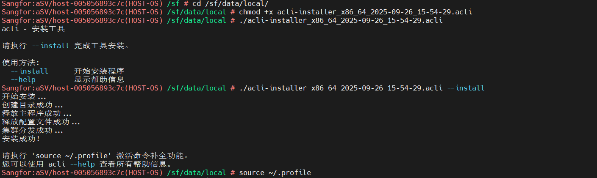
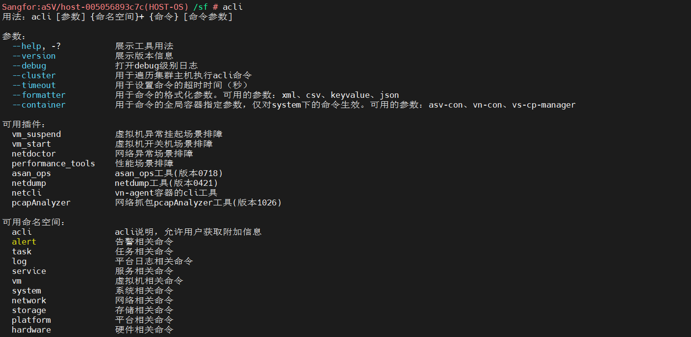
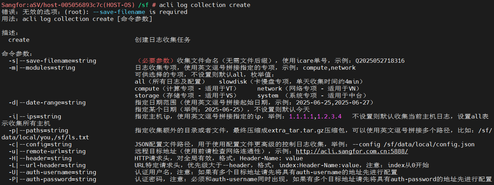
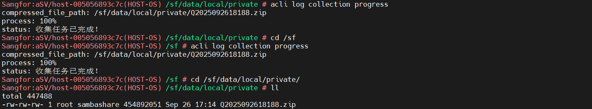
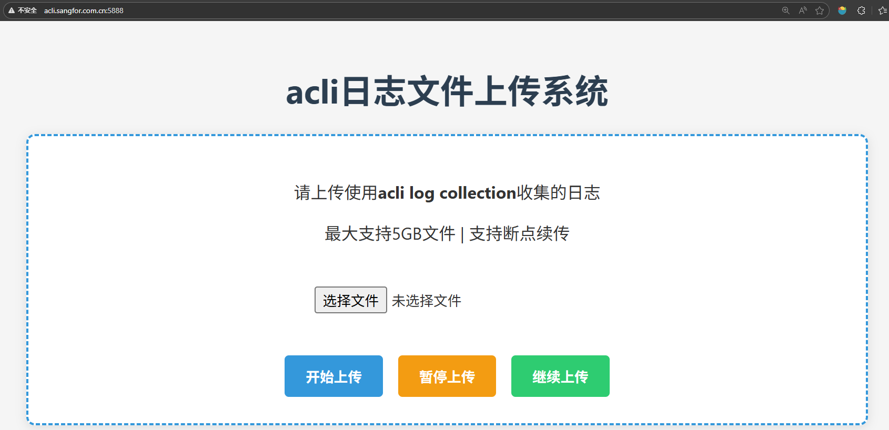

# 欢迎使用

## 下载

- [X86 平台](@site/static/files/acli_x86.acli)
- [ARM 平台](@site/static/files/acli_arm.acli)

## 安装

- 上传至 HCI 环境`/sf/data/local/`下
- 执行：`chmod +x acli-installer_x86_64_YYYY-MM-DD_HH-mm-ss.acli`对工具添加执行权限
- 执行：`./acli-installer_x86_64_YYYY-MM-DD_HH-mm-ss.acli --install`等待安装完成
- 执行：`source ~/.profile`生效 aCLI 自动补全功能
  

## 使用

- 输入：`acli`可以 aCLI 的帮助信息，如图主要分为三部分：参数、可用工具和可用命名空间
- 可用工具主要包含常用故障场景一键排障工具和各技术支持团队工具
- 可用命名空间主要包含常用排障命令如`alert`、`task`、`log`和常用运维命令如`vm`、`storage`、`platform`等
  

## 示例

- 如下以收集日志为例
- 输入：`acli log collection create`可以查看创建日志收集异步任务的帮助信息
  
- 如帮助信息所示，目前已支持如下专项，如无特殊要求可使用`-m all`来收集所有日志，使用`-d`指定时间段，使用`-i`指定 host，使用`-s`指定 ICare 问题单
- 示例：`acli log collection create -m all -d 2025-09-25,2025-09-26 -i all -s Q2025092618188`
  
- 输入：`acli log collection progress`可以查看收集任务进度
  
- 收集日志的打包文件存放在`/sf/data/local/private/`目录下
  
- 使用 SFTP 工具下载的远程桌面
- 上传到[日志文件系统](http://acli.sangfor.com.cn:5888)
  

# aCLI简介

深信服 aCLI 是 HCI 命令行工具，用于 HCI 平台的排障和运维。  

## 应用场景

### 1、自主排障

+ aCLI已支持多个故障场景一键排障（目前已发布：虚拟机挂起、虚拟机开关机、网络异常、性能异常和序列号 5个场景，后续计划中：主机离线）；
- 运行场景排障自动对环境进行检查，针对故障场景提供自动化处置或者KB处置方案等多种方式；
- 用户可依据kb链接进行自助排障处置与恢复；
  
- aCLI已提供多个易用工具（包括：日志收集工具`acli log`、虚拟存储检测工具`acli asan_ops`、网络抓包分析工具`acli netdump`和`pcapAnalyzer`）;
- 使用工具更简单、更高效、更安全的完成相关操作，每个工具都有详细的使用说明且都支持异步处理；
- 用户可选择对`alert`（告警)、`task`（任务）、`log`（日志）和`service`（服务）等对象进行管理；

- 客户打开本地的 SSH 工具，使用排障用户`support`和排障密码去登录问题集群的排障后台；
- 排障后台只能支持排障`acli`命令与部分`Linux`命令，其他命令都无法执行；
- 排障后台所有执行的命令都将被记录在特定的日志中；

### 2、日常运维

+ 对齐HCI页面虚拟机、网络、存储、实体机和系统管理的UI操作方式
- aCLI提供了`vm`、`network`、`storage`、`hardware`和`platform`的命令
  

## 功能特性

+ 支持主机粒度与集群粒度
- 使用快捷方便
- 有广泛的社区经验文档支持
- 持续维护
- ......

## 目标用户

- [x] 开发技术人员
- [x] 技术支持人员
- [x] CTI技术人员
- [x] 一线技术支持人员
- [x] 总代技术人员
- [x] 渠道技术人员
- [x] 客户技术人员
- [x] ......
